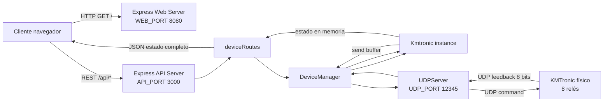
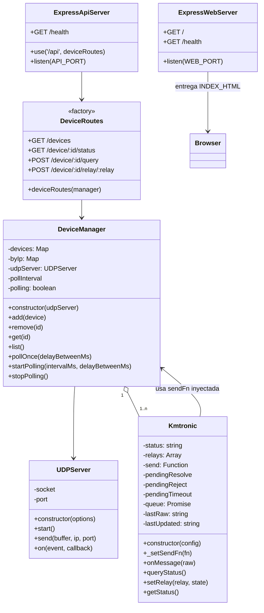
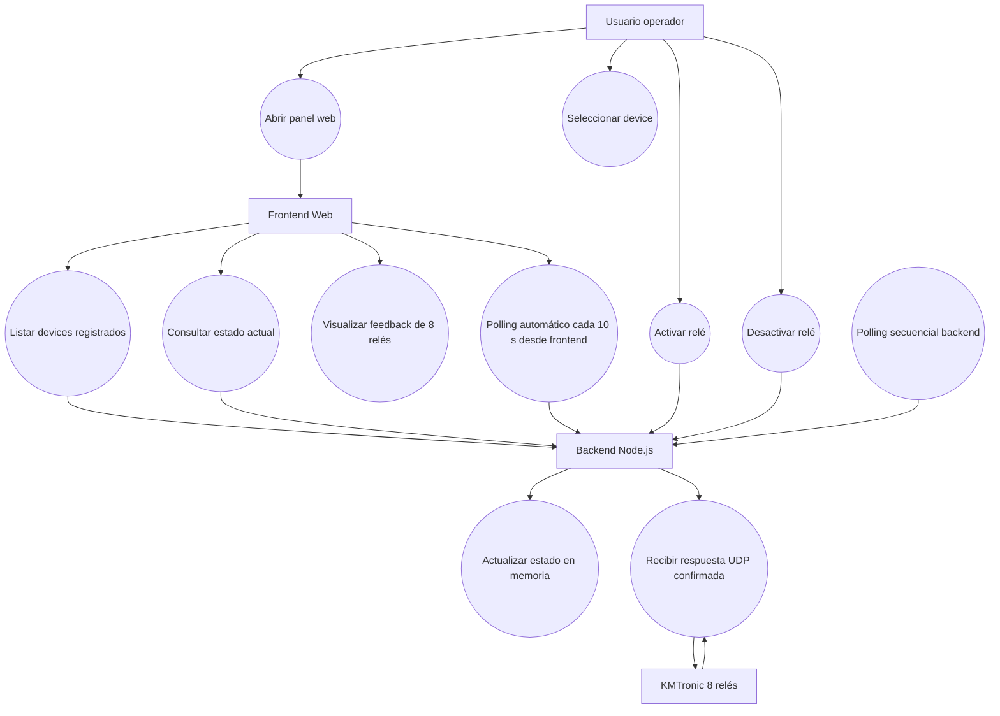
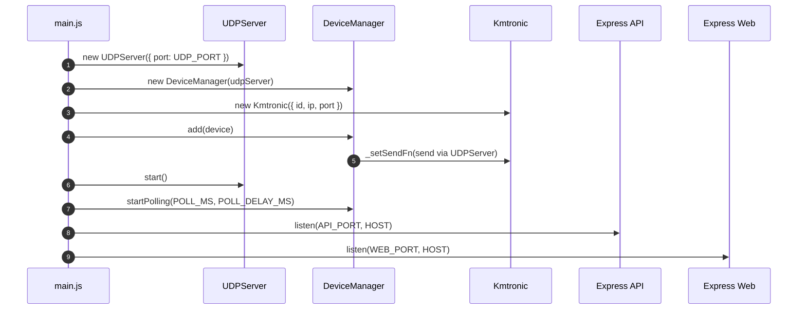
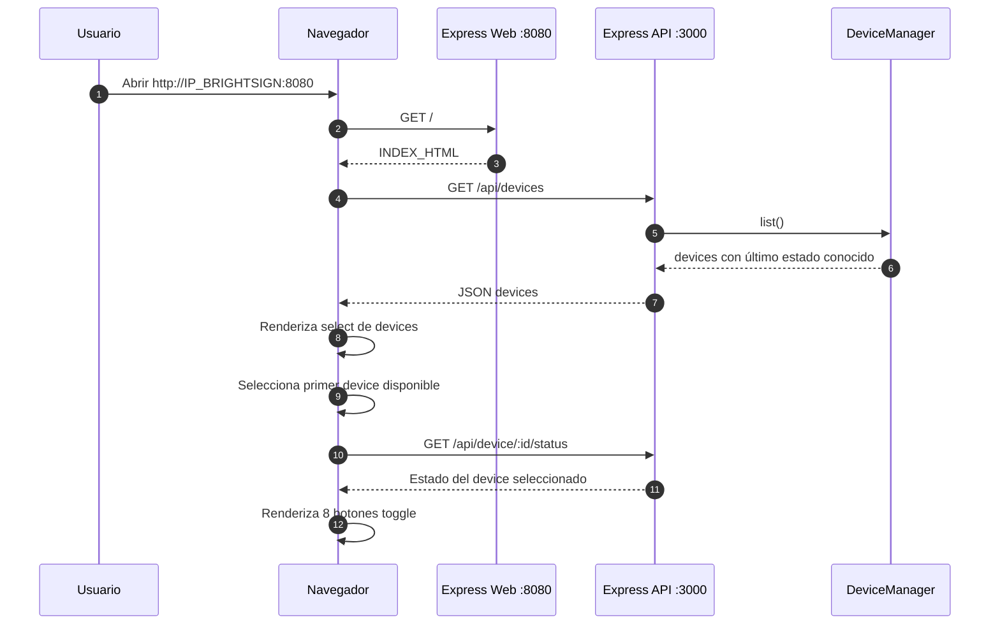
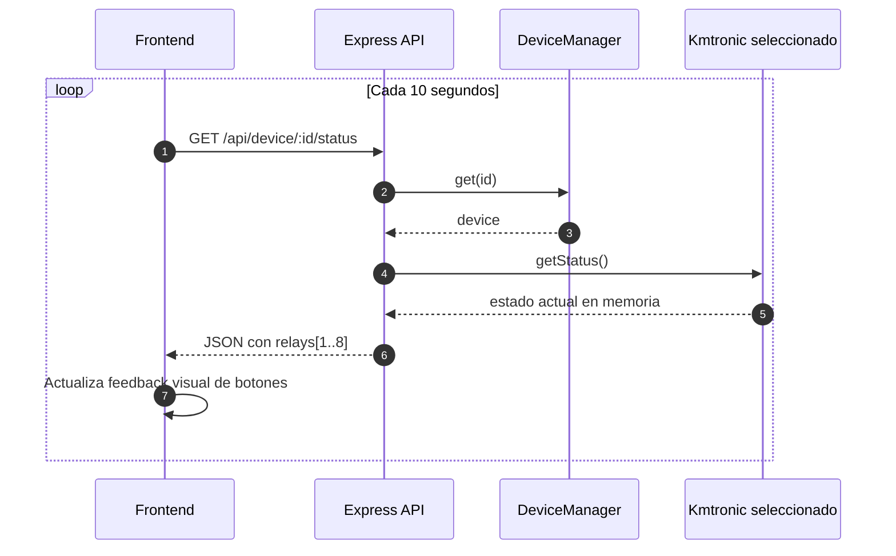
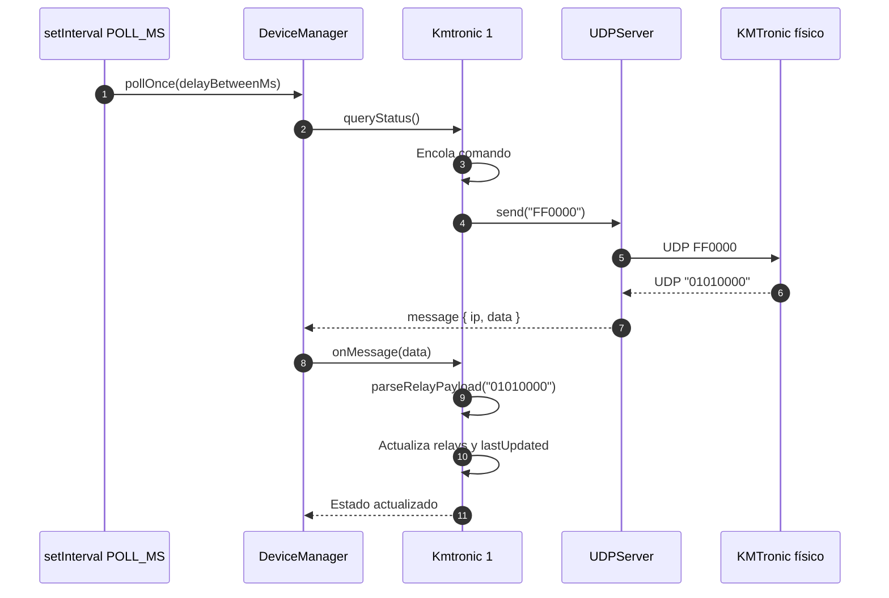
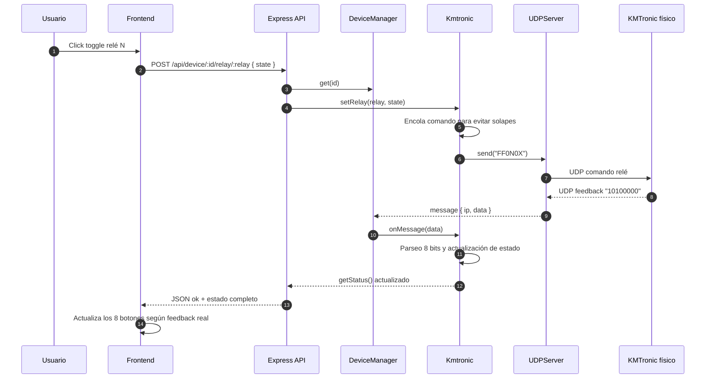
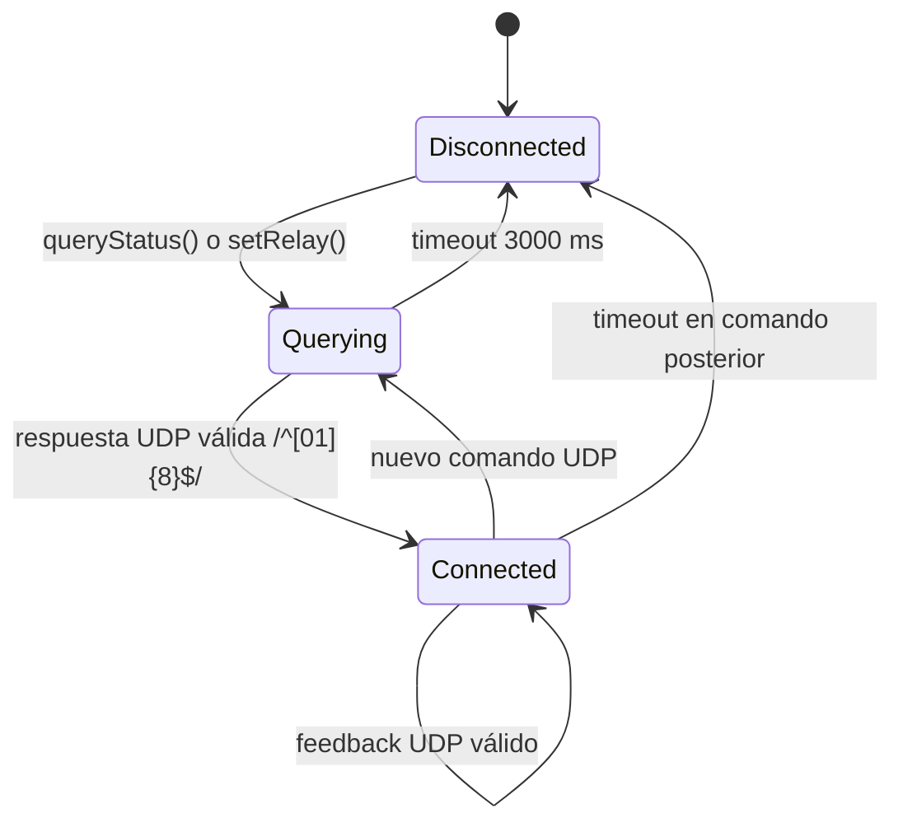
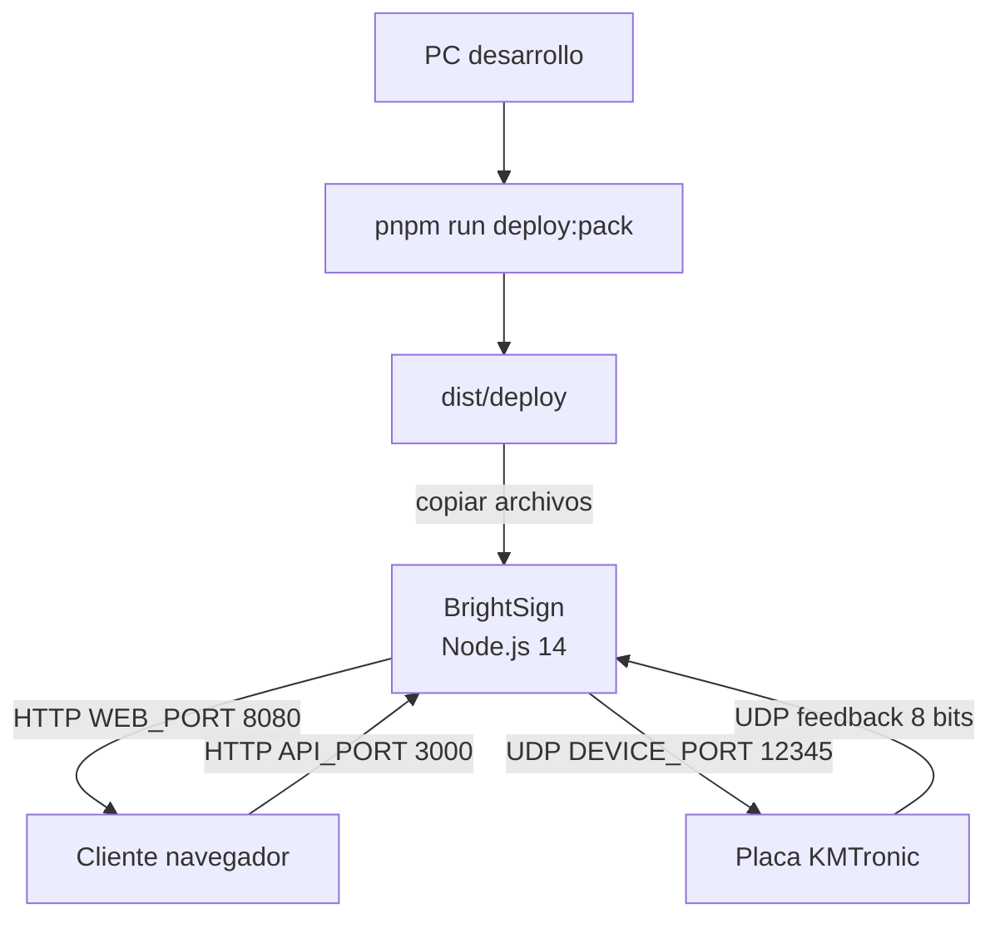

# Diagramas UML y documentación técnica

Este documento complementa el `README.md` principal y describe la arquitectura interna, los casos de uso y los flujos principales de funcionamiento de la aplicación KMTronic BrightSign Control.

Los diagramas están escritos en **Mermaid**, por lo que pueden visualizarse directamente en GitHub, GitLab, VS Code con extensión Mermaid, Obsidian o cualquier visor compatible.

---

## 1. Visión general de arquitectura

La aplicación se ejecuta como **un único proceso Node.js** en el BrightSign. Dentro de ese proceso se levantan dos servidores HTTP independientes y un socket UDP:

- **Servidor Web**: entrega el panel HTML en `WEB_PORT`, por defecto `8080`.
- **Servidor API REST**: expone endpoints en `API_PORT`, por defecto `3000`.
- **Servidor UDP**: envía comandos al KMTronic y recibe feedback de estado.
- **DeviceManager**: instancia y coordina los dispositivos registrados.
- **Kmtronic**: representa un dispositivo físico de 8 relés.



---

## 2. Diagrama de clases

Este diagrama refleja las clases principales del backend y sus responsabilidades.



### Responsabilidad de cada clase/módulo

| Elemento | Responsabilidad |
|---|---|
| `main.js` | Arranque de la aplicación. Crea API, servidor web, UDP server, manager y dispositivos registrados. |
| `UDPServer` | Abstracción del socket UDP. Envía comandos y emite mensajes recibidos. |
| `DeviceManager` | Registro central de dispositivos, resolución por IP, polling secuencial y enrutado de respuestas UDP. |
| `Kmtronic` | Estado de un dispositivo físico. Parseo de feedback de 8 bits, cola de comandos y API de control de relés. |
| `deviceRoutes` | Endpoints REST consumidos por el frontend. |
| `publicHtml.js` | HTML embebido para permitir bundle en un solo archivo con `esbuild`. |

---

## 3. Diagrama de casos de uso

Actores:

- **Usuario operador**: persona que accede al panel web y controla relés.
- **Frontend Web**: cliente HTML/JS servido por BrightSign.
- **Backend Node.js**: API REST + manager + UDP.
- **KMTronic**: placa física de relés.



---

## 4. Secuencia de arranque de la aplicación



### Resultado esperado

Al finalizar el arranque:

- El panel web está disponible en `http://IP_BRIGHTSIGN:8080`.
- La API REST está disponible en `http://IP_BRIGHTSIGN:3000/api`.
- El socket UDP escucha en `UDP_PORT`.
- Hay una instancia `Kmtronic` por device registrado.
- El backend empieza a hacer polling secuencial.

---

## 5. Secuencia de carga inicial del frontend



---

## 6. Secuencia de polling automático del frontend

El frontend no consulta todos los dispositivos. Solo consulta el estado en memoria del device seleccionado.



### Nota de diseño

Este endpoint no lanza tráfico UDP. Devuelve el último estado conocido por el backend, evitando saturar la placa con polling duplicado desde cada navegador conectado.

---

## 7. Secuencia de polling secuencial del backend

El backend es quien interroga periódicamente a todos los devices registrados.



Si se registran más devices, `DeviceManager.pollOnce()` los recorre uno por uno y aplica `POLL_DELAY_MS` entre dispositivos.

---

## 8. Secuencia de activación/desactivación de un relé

Cuando el operador pulsa un botón, la API lanza el comando UDP y espera la respuesta confirmada del KMTronic. Esa respuesta debe contener el estado completo de los 8 relés.



---

## 9. Máquina de estados simplificada de un device



---

## 10. Modelo de datos de estado REST

Ejemplo de respuesta esperada para un device:

```json
{
  "id": "kmtronic-1",
  "ip": "192.168.0.115",
  "port": 12345,
  "status": "connected",
  "raw": "10100000",
  "lastUpdated": "2026-05-19T19:30:00.000Z",
  "relays": [
    { "relay": 1, "state": "on" },
    { "relay": 2, "state": "off" },
    { "relay": 3, "state": "on" },
    { "relay": 4, "state": "off" },
    { "relay": 5, "state": "off" },
    { "relay": 6, "state": "off" },
    { "relay": 7, "state": "off" },
    { "relay": 8, "state": "off" }
  ]
}
```

### Regla de parseo

```mermaid
flowchart LR
    Raw[Payload UDP "10100000"] --> Split[Separar en 8 caracteres]
    Split --> R1[Relé 1 = 1 = ON]
    Split --> R2[Relé 2 = 0 = OFF]
    Split --> R3[Relé 3 = 1 = ON]
    Split --> R4[Relé 4 = 0 = OFF]
    Split --> R5[Relé 5 = 0 = OFF]
    Split --> R6[Relé 6 = 0 = OFF]
    Split --> R7[Relé 7 = 0 = OFF]
    Split --> R8[Relé 8 = 0 = OFF]
```

---

## 11. Diagrama de despliegue



### Puertos implicados

| Puerto | Protocolo | Uso |
|---:|---|---|
| `8080` | HTTP | Panel web servido al navegador. |
| `3000` | HTTP | API REST consumida por el panel. |
| `12345` | UDP | Comunicación con la placa KMTronic. |

---

## 12. Consideraciones recomendadas

### Producción en BrightSign

- Fijar IP estática del BrightSign.
- Fijar IP estática del KMTronic.
- Verificar conectividad UDP entre ambos equipos.
- Evitar que varios procesos Node controlen la misma placa simultáneamente.
- Mantener un único proceso responsable de polling y comandos.

### Escalabilidad a varios KMTronic

La arquitectura ya soporta varios devices añadiendo nuevas entradas al array `registeredDevices`. El `DeviceManager` mantiene:

- Mapa por `id`, para acceso desde REST.
- Mapa por `ip`, para enrutar respuestas UDP al dispositivo correcto.
- Polling secuencial, para evitar colisiones de tráfico y respuestas mezcladas.

### Mejora futura recomendada

Actualmente el registro de devices está en `main.js` usando variables de entorno. Para instalaciones grandes puede ser mejor moverlo a un fichero externo `devices.json`, por ejemplo:

```json
[
  {
    "id": "rack-av-1",
    "ip": "192.168.0.115",
    "port": 12345
  }
]
```

Esto permitiría modificar la instalación sin recompilar el bundle.
